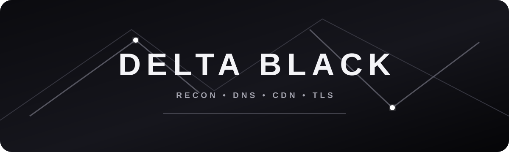

# DELTA BLACK

```text
██████╗ ███████╗██╗  ████████╗ █████╗
██╔══██╗██╔════╝██║  ╚══██╔══╝██╔══██╗
██║  ██║█████╗  ██║     ██║   ███████║
██║  ██║██╔══╝  ██║     ██║   ██╔══██║
██████╔╝███████╗███████╗██║   ██║  ██║
╚═════╝ ╚══════╝╚══════╝╚═╝   ╚═╝  ╚═╝

        B L A C K   R E C O N   S U I T E
```

<p align="center">
  
</p>

<p align="center">
  <b>CDN / DNS exposure assessment toolkit</b><br>
  Focused, modular, terminal-first reconnaissance for authorized testing.
</p>

<p align="center">
  <a href="https://t.me/Delta167">Telegram</a> •
  <a href="LICENSE">MIT License</a>
</p>

---

## Overview

DELTA BLACK checks a target domain for Cloudflare presence, inspects historical DNS sources, and enumerates common subdomains that may expose infrastructure outside a CDN.

The project is intended for systems you own or have explicit permission to assess.

## Highlights

- Cloudflare detection
- Historical IP lookups
- Concurrent subdomain enumeration
- DNS resolution
- Web server header detection
- TLS certificate inspection
- Configurable concurrency and timeouts
- Optional CSV reporting
- Clean terminal output
- Built-in wordlist handling
- No JSON report generation or JSON output files

## Project Layout

```text
DELTA-BLACK/
├── assets/
│   └── delta-black.svg
├── tests/
│   ├── __init__.py
│   ├── test_historical.py
│   └── test_scanner.py
├── config.ini
├── config.py
├── delta_black.py
├── historical.py
├── network.py
├── report.py
├── requirements.txt
├── scanner.py
├── wordlist.txt
├── wordlist2.txt
├── LICENSE
└── README.md
```

## Installation

```bash
python3 -m pip install -r requirements.txt
```

On Termux:

```bash
pkg update
pkg install python
python3 -m pip install -r requirements.txt
```

## Usage

Basic scan:

```bash
python3 delta_black.py example.com
```

Run without historical lookups:

```bash
python3 delta_black.py example.com --skip-historical
```

Run without subdomain enumeration:

```bash
python3 delta_black.py example.com --skip-subdomains
```

Use a custom wordlist:

```bash
python3 delta_black.py example.com --wordlist wordlist.txt
```

Adjust concurrency and timeout:

```bash
python3 delta_black.py example.com --concurrency 20 --timeout 10
```

Write an optional CSV report:

```bash
python3 delta_black.py example.com --format csv --output results.csv
```

Skip interactive confirmation:

```bash
python3 delta_black.py example.com --yes
```

Enable verbose logging:

```bash
python3 delta_black.py example.com --verbose
```

Refresh the bundled wordlist:

```bash
python3 delta_black.py example.com --update-wordlist
```

Show all command-line options:

```bash
python3 delta_black.py -h
```

## SecurityTrails

SecurityTrails support is optional.

Set the API key in `config.ini`:

```ini
[DEFAULT]
securitytrails_api_key = your_key_here
```

Do not commit real API keys to a public repository.

## Output

DELTA BLACK does not generate JSON files.

By default, scan results are printed directly to the terminal. CSV export is available only when explicitly requested with `--format csv`.

## Development

Run the test suite from the project directory:

```bash
python3 -m unittest discover -s tests -v
```

## Attribution

[](https://t.me/Delta167)

The original MIT license and copyright notice are preserved in `LICENSE`.
Upstream credit remains intact.

## Modified By

**DELTA**

Telegram: **@Delta167**

## Legal Notice

Use DELTA BLACK only against systems you own or systems for which you have explicit authorization to perform security testing.

---
